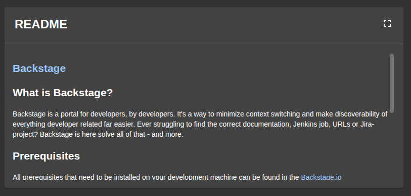
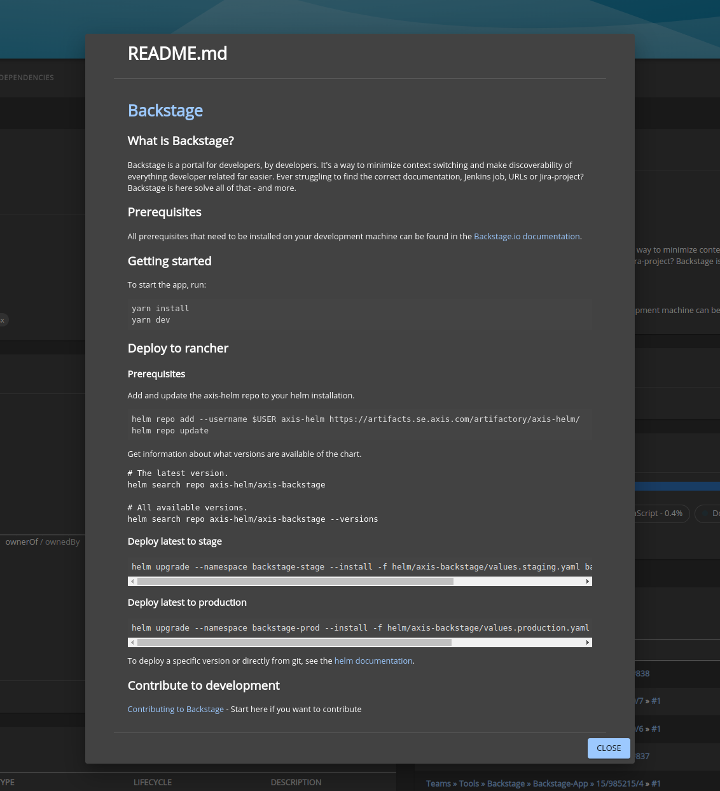

# Readme plugin

Welcome to the readme plugin!



## Introduction

The `README-plugin` enables easy access and viewing of the README.md file. By having information such as the project's purpose, usage instructions, or installation details as a central part of the EntityPage, we hope to improve the `onboarding and understanding of entities`.

The README.md file is always retrieved from the same directory as the `catalog-info.yaml file`, also known as the `entity source location`. If you wish to view the path where the plugin looks for your README.md file, you can find it in the backstage.io/source-location annotation in the catalog-info.yaml file (see the example below). This annotation is automatically added to your entity, so there is no need to add it manually.

```yaml
annotations:
  backstage.io/source-location: url:https://github.com/AxisCommunications/backstage-plugins/blob/main/
```

Currently, placing your README.md file elsewhere than in the same directory as the `catalog-info.yaml file` repository is not supported.

The displays README files with one of the following file types:

```ts
{ name: 'README', type: 'text/plain' },
{ name: 'README.md', type: 'text/markdown' },
{ name: 'README.rst', type: 'text/plain' },
{ name: 'README.txt', type: 'text/plain' },
{ name: 'README.MD', type: 'text/markdown' },
```

The plugin can also handle symlinks in the README file.

## Note

You will **need** to also perform the installation instructions in [Readme Backend](https://github.com/AxisCommunications/backstage-plugins/blob/main/plugins/readme-backend) in order for this plugin to work.

## Getting started

1. First, install the plugin into your app:

```bash
# From your Backstage root directory
yarn add --cwd packages/app @axis-backstage/plugin-readme
```

2. Then, modify your entity page in `EntityPage.tsx` to include the `ReadmeCard` component that is exported from the plugin to `overviewContent``.

```tsx
// In packages/app/src/components/catalog/Entity.tsx
import { ReadmeCard } from '@axis-backstage/plugin-readme';

const overviewContent = (
...
  <Grid item md={6} sx={12}>
      <ReadmeCard />
</Grid>
  ...
)
```

## Layout

The readme card is located in the overview page on the entity page. From the card header it is also possible to open a dialog displaying the full README.md.




### Troubleshooting

#### "No README.md file found at the source location..."

This message indicates that the backend cannot find your README.md file. Ensure that the README.md file is indeed located in the same directory as the `catalog-info.yaml file`. If you are still unable to locate it, try scheduling an entity refresh by clicking the "Schedule Entity Refresh" button in the AboutCard of the entity.
